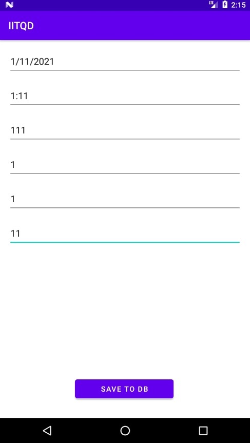
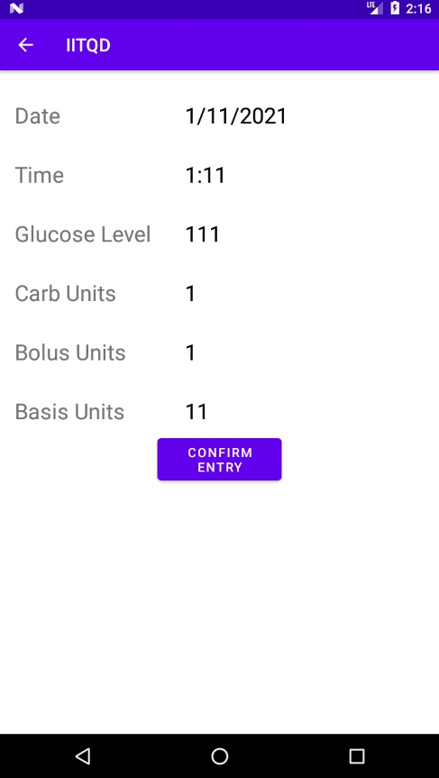

This is the POC to [glpred_MVP](https://github.com/Friedrich-Mueller/glpred_MVP)

This is the very first functioning backbone prototype of an android application that utilizes machine learning to estimate glucose levels after 3, 4 and 5 hours. It cooperates with an android application nested SQLite database, fed with data via an android app at the point of intake of a meal, which is accessed via the android debug bridge (adb), as well as the FreeStyle Libre 2 glucose measuring device, which constantly measures glucose level via an applied FreeStyle Libre 2 sensor.

For this to function, it requires two steps beforehand.

1. Connect the FreeStyle Libre 2 device to the machine and manually use the FreeStyle Libre applications "export data" function to pull its recorded data from the device. Disconnect the device.

2. Connect the android device that holds the corresponding android app, which is used to input data for a meal.

This backbone then uses the data manually recorded with the android app, and scans the FreeStyle Libre 2 data for glucose levels after 3, 4 and 5 hours past a manually recorded data point. Combining the two, a sample with a corresponding (continuous) label is generated for each data point entered in the android app.

Following, a model is trained with the generated data.

For more understanding:

The Freestyle Libre 2 device holds, among others, records for datetime and glucose level, which are being recorded automatically every 15 minutes.

The android app allows the input (and recording via a SQLite database) of 5 values, which together build the input vector in regards to machine learning. Those are date, time, glucose level at the time, consumed carb units at the time, injected insulin at the time,  and injected long term insulin (injected once, twice or in some cases three times a day). Using the input vectors date and time value allows to connect a later in time glucose level from the FreeStyle Libre 2 data, thereby creating input vector and (regression) label and allowing the usage of machine learning for predictions.

Screenshots of the app in current state:

TODO for first running version:

- Rewrite backbone in java, as java models are alot more easy to be placed in a (java/kotlin based) android app.

- Add a button to get a prediction for a manually input data point, because as of right now, predictions could be made on a PC, while data is collected via the app. The idea is to have both be done on the phone, and only occasionally generate data and retrain the model on PC. Even when done there is some overhead to keep this app working nicely, and doing so requires utmost delicacy, but being able to accurately predict glucose level outcome based on amount of insulin injected, thereby allowing to adept insulin amount and aiming for a desired glucose level after 3, 4 and 5 hours, is the ultimate gain.

## Disclaimer

It is important to mention that it is by no means advised that anybody uses this without in depth knowledge about machine learning, data acquisition and the intricacies of type 1 diabetes treatment in the shape of the intensified insulin therapy(IIT). 